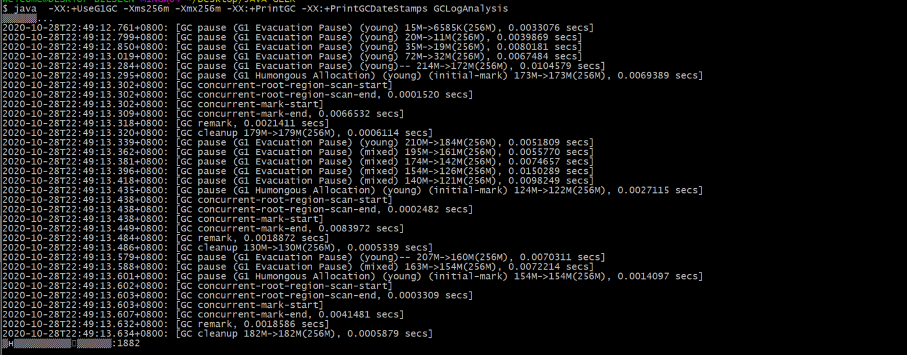

### Week02作业--GC算法总结

---

#### 概述

- 在课程内老师演示了的四种GC算法:**串行GC，并行GC，CMS(Concurrent Mark Sweep)和G1**，从GC算法的命名大致也能猜出一点是以何种方式执行垃圾回收。这四种GC算法都有各自适用的场景，并不是哪一个已经被淘汰，例如串行GC在多核cpu平台似乎无法充分利用资源，在JVM的GC算法设置中也同样支持。
- 这里还有一点对于并行GC和CMS GC 的误解，之前没有多想，其实也就是并行和并发的区别：**并行GC**会导致用户线程等待，**CMS GC**则是并发执行GC，不干扰用户线程执行

---

#### GC策略执行演示

##### 执行环境 : i7-8565 ，8核处理器 ，8G内存

##### 串行GC

- *命令*  ： java -XX:+UseSerialGC -Xms512m -Xmx512m -XX:+PrintGCDetails -XX:+PrintGCDateStamps GCLogAnalysis

- 执行结果:

  

  

  

- **数据分析**：用JAVA代码利用正则表达式提取了下 **young 区GC**的关键信息，对应三次GC分别如下

  - 第一次GC
  - 第二次GC
  - 第三次GC
  - 小结：
    - 设置堆内存为512M的情况下没有看到fullGC出现，但是每次young 区内存回收效率都很高，达到90%
    - 三次GC演示都出现了young区无法再进行内存回收的情况，回收前后内存使用没有变化，紧跟着就是一次老年代的GC，在老年代GC完毕，堆内存可用部分增长的情况下，之后的young GC又恢复高效的GC模式
    - 这里没有出现young区无法GC自动扩容的情况，看群友运行GC出现堆内存和young区内存随着运行情况发生变化，解释是young区的初始内存并不是最大内存，因此会发生扩容，堆内存也一样；**是否是因为配置一样大小的 -Xms 和 -Xmx 所以最开始就分配了最大对堆内存，同时也按照比例分配好了young区最大内存，因此不会自动扩容？**

##### 并行GC

- *命令* ： java  -Xms512m -Xmx512m -XX:+PrintGCDetails -XX:+PrintGCDateStamps GCLogAnalysis

- 执行结果 ： 

  - 第一次GC:

    

  - 第二次GC:

    

  - 第三次GC:

- **数据分析 **: 把三次GC日志(log/PGC01.txt)的youngGC分三次读取，用python脚本(PGCRead.py)画成了折线图，观察GC前后的差异

  - 第一次GC
- 第二次GC
  - 第三次GC
  - 小结：
    - 可以看到三次GC的趋势几乎是一致的，不论是young区的内存占用，还是几个拐点的出现位置都大致相似
    - 仅观察图中GC前后差异比较大的部分，结合日志，可以看出GC的效率最开始都比较高；在第一个拐点出现的前一个位置，发生了**young区缩容**，**堆内存缩容**；在拐点位置发生了 **young 区扩容**，**堆内存扩容**。按照横坐标4->5->6三个点的位置，young区配比的变化是:30.4%->18.7%->25% ;还发现一点：这个过程中young区的内存变化量和整个堆内存的变化量是一致的，是否可以认为只有young区在扩容？
    - 图中几个GC后触底的点代表着发生了FullGC，日志里fullGC部分能看到每次fullGC之后 old区的内存使用量都在增大，符合老师说的**清空了young区将部分仍需要存活的对象晋升到老年代**
  - 这里我有一点疑问 : **在第一次young区扩容之后，young区的使用率都不会再超过扩容时的使用率(扩容前可以接近100%，扩容后维持在70%左右)，是因为扩容之后young区大小被固定，重新设置了young区回收的阈值吗？**

##### CMS GC

- *命令* ：java  -XX:+UseConcMarkSweepGC -Xms512m -Xmx512m -XX:+PrintGCDetails -XX:+PrintGCDateStamps GCLogAnalysis

- **执行结果** : 
  
  - 第一次GC
  - 
  - **第二次GC:**
  - **第三次GC:**
  
- **结果分析**: 

  - 首先CMS GC 有 `初始标记-并发标记-并发预清理-最终标记-并发清除-并发重置`这样的阶段转换
  - 在标记发生之前，发生了几次 youngGC ，对应的GC策略是 ParNew ，查了一下是串行GC的多线程版本，young区使用的是复制算法；这几次youngGC有一个比较明显的现象： **GC之后的大小都是17M**，看到最后堆信息显示 from 和 to 的大小也是 17M ，复制算法中认为98%的对象都会快速死亡，因此给Eden 和 Survivor 空间配比为 8:1 ，刚好符合这种内存的分布情况
  - //TODO

  

##### G1 GC

- **命令:** 
  - java  -XX:+UseG1GC -Xms512m -Xmx512m -XX:+PrintGC -XX:+PrintGCDateStamps GCLogAnalysis
  - java  -XX:+UseG1GC -Xms256m -Xmx256m -XX:+PrintGC -XX:+PrintGCDateStamps GCLogAnalysis
- **执行结果** ： 
  - 只发生youngGC : 
  - 发生CMS GC:  
- **结果分析:**
  - 设置 -Xms 和 -Xmx 为512M 时，只发生youngGC，最终的young区占比没有到50%
  - 设置 -Xms 和 -Xmx 为256M 时，最后一次youngGC内存使用超过了80%，触发了CMS GC
  - 执行了一次 -Xms 和 -Xmx 为 256的CMS GC ，对比了一下并发标记阶段，生成了2899个对象，CMS GC耗费了 673ms；G1 的 GC生成了 2689个对象 ， CMS阶段耗费了 574 ms ，仅从这点看，效率是略高于CMSGC的

---

##### 触发OOM/频繁Full GC ： 将 -Xms 和 -Xmx 设置为 128m

-  **串行GC** : 没有发生OOM，但是几次youngGC之后，一直处于fullGC状态，用户线程只能一直处于等待状态
- **并行GC** :  几次 youngGC之后，频繁的发生fullGC，最终 OOM
- **CMSGC** ： 没有发生OOM，但是最终并发标记过程执行失败，就此终止
- **G1 GC** ： 最终发生OOM

---

##### 作业未完成，还是先交了。

