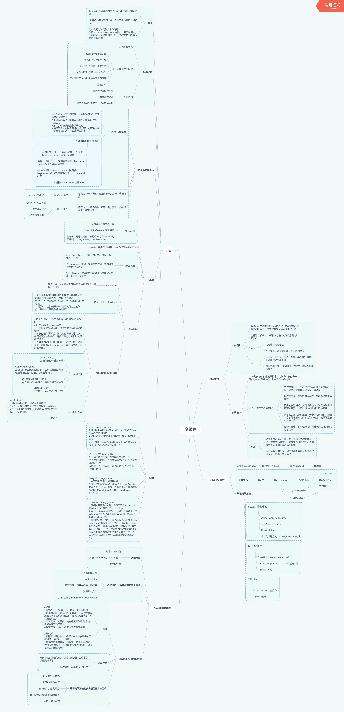

## 第四周作业

---

### 说明

- `HomeWork04.java` 是第一个必做作业的实现，主线程中异步执行子线程方法，保证获取到返回值之后输出然后退出主线程，只想到了8种实现方法，有些是类似的方式(*都加锁等待*)

- `多线程与并发.xmind`是第二个必做作业的Xmind 文件，导出图片如下:

  ​	

  比起脑图更像是一个总结性质的流水账的一样的东西，脑图应该不是这么画的，之间没有很好地关联起来。

---

### 感想

- 前阵子看到群里有同学说交了作业就已经超过400多人了，助教老师说了句"态度很重要"，让我觉得有点羞愧，第二次写得比较赶时间，应付就交上去了，实际上是敷衍自己了，不该。
- 看了第三次作业的评论，说"流程图画得很好，比别人多想一步，就是自己的收获"，很对，思维惰性和自满要不得
- 昨天下班回来之后，想着先打把游戏再继续画这个脑图；转念一想不对，我可以一直打游戏不画这个图了；继续一想也不对，我完全可以不上课，有时间都拿来打游戏；那其实可以不报这个课程，钱拿来花到别的地方去...然后就冷静下来了
- 没有自制力的人，是没有未来的

