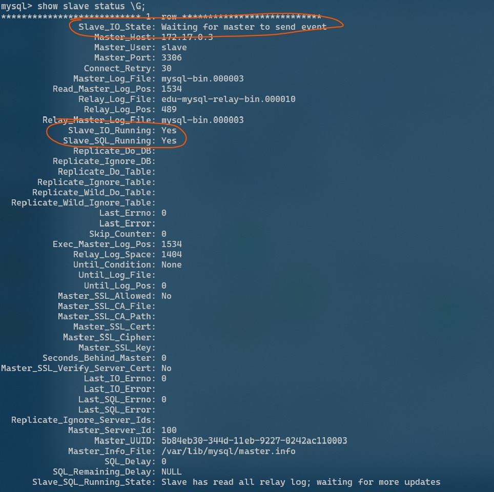
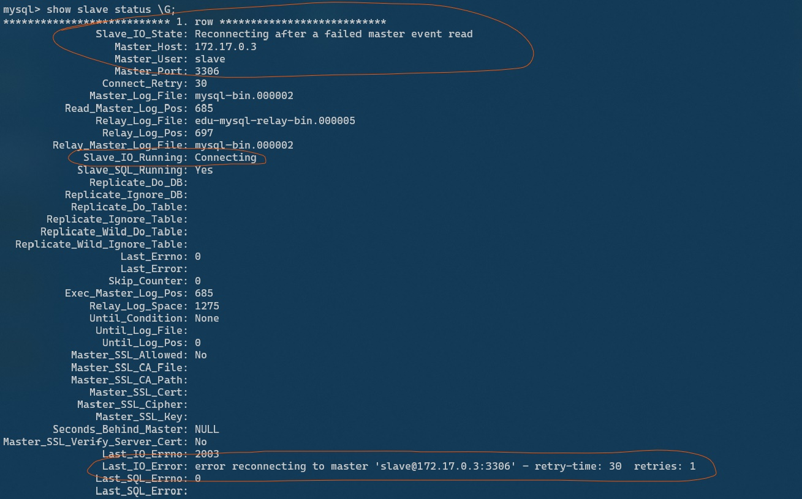
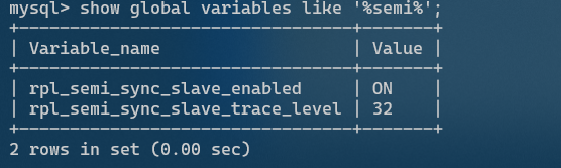
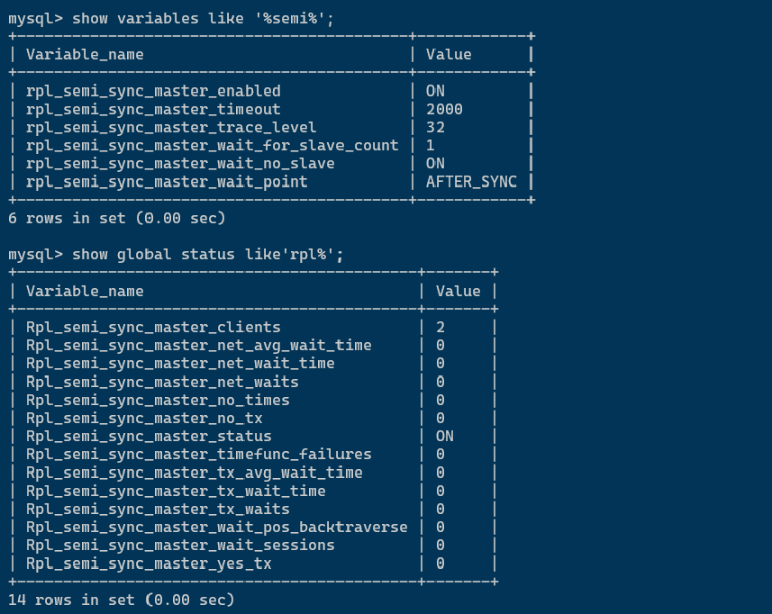
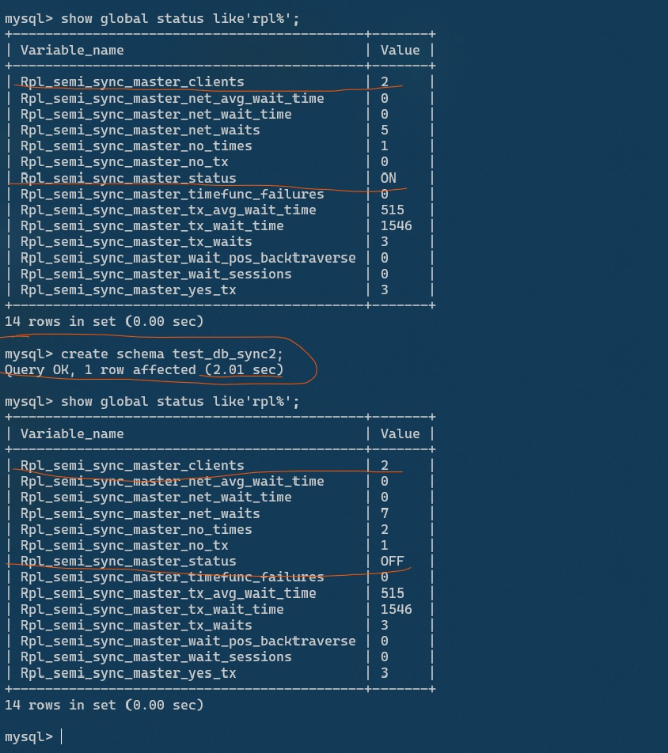

## 第七周选做-配置异步复制，半同步复制，模拟master宕机

---

#### MYSQL 主从

- **环境准备** ： 简单起见，用 **docker** 起了三个数据库，主 3339 ，从 3340，3341 。 参照了这篇文章：  https://www.cnblogs.com/songwenjie/p/9371422.html ， 全部运行起来 : 

  

- **异步复制** ：

  - **配置主从** ：步骤和秦老师 md 文件里写的是一样的，就是主库上指定server-id和log-bin，配置访问用户和用户权限；从库上指定master 信息；(`我的windows死活跑不起来第三个实例，所以就改成docker 了`)

    - 连接主库docker容器 ， 在 `/etc/mysql` 下编辑 `my.cnf` ，添加 `server-id  = 100  ，log-bin=mysql-bin`，重启 mysql 和 docker  container  
    - 连接从库docker容器，在 `/etc/mysql` 下编辑 `my.cnf` ，添加 `server-id  = 101  ，log-bin=mysql-bin，relay_log=edu-mysql-relay-bin`, 
    - *然后连接从库数据库*，执行 `change master to master_host='172.17.0.3', master_user='slave', master_password='123456', master_port=3306, master_log_file='mysql-bin.000001', master_log_pos= 714, master_connect_retry=30; ` 指定主库的 地址，端口，连接的用户信息，开始同步的 `bin_log`名称和开始同步的位置，连接重试次数
    - 重启从库的MySQL服务和容器，`docker ps` 就能看到上图的情况了

  - **使用**：

    - 连接slave数据库，查看一下状态 : `show slave status \G;`

      

    - 从节点正常会显示这些信息，其中 `Slave_IO_Running,Slave_SQL_Running` 最开始是 NO ，要先执行 `start salve `  ，状态才会置为YES 表示开始同步

    - 验证也比较简单，主库创建数据库和表，然后写入数据，在从库查询，看到相同的库表和数据就表示同步了。

    - `master宕机` ： 异步复制模式下，master 宕机，salve 会尝试重连，记录重连次数：

      

    - `Slave_IO_Status` 显示重连，`Slave_IO_Running` 显示连接中， `Last_IO_Error` 最后记录了尝试重连的次数；master 重新上线状态就恢复正常了。

- **半同步复制**

  - 参考了秦老师资料里的文章  :  `https://www.cnblogs.com/zero-gg/p/9057092.html` 
  - 主库配置 ： 
    - 连接主库，安装插件  ： ```install plugin rpl_semi_sync_master soname ``'semisync_master.so'`;` 
    - 设置master 开启半同步，设置同步超时时间 : `set global rpl_semi_sync_master_enabled = 1; set global rpl_semi_sync_master_timeout = 2000;` 超时时间设置了2秒

  - 从库配置 :

    - 连接从库，安装插件 : `install plugin rpl_semi_sync_slave soname 'semisync_slave.so';``

    - 开启半同步 : `` set global rpl_semi_sync_slave_enabled = 1;` 

    - 重启 `io_thread` ： `stop slave io_thread; start slave io_thread;`

    - 查看状态 : ` show global variables like '%semi%';`  

      

    - 回到主库查看半同步状态 : `show global status like'rpl%';`

      

    - `Rpl_semi_sync_matser_clients : 2` 表示有两个开启半同步复制的 slave 节点；`Rpl_semi_sync_master_status : ON` 表示master半同步插件是开启的

  - `模拟半同步master 宕机` : 

    - 正常情况下，主库创建一个数据库在 0.01 秒内完成，为了模拟master 宕机，master先创建一个数据库，观察耗费时间； 然后停掉一个slave ，master 继续创建数据库；再停掉另一个slave ，master 再创建数据库；

    - 最后的结果显示 ： 

      - 一个 salve 下线，master 是可以很快同步数据到另一个 slave 然后收到响应

      - 所有 slave  都下线，master 等待同步响应信息，直到超时，超时场景如下图:

        

      - 停止第二个 slave  之前查看了一下 master 的状态 ，显示 `Rpl_semi_sync_master_status : ON` 表示还是开启了半同步的；

      - 随后停止slave ，执行 `create schema test_db_sync2;` 可以看到耗费的时间是 2.01 秒 ，也就是 master 等待半同步响应超时了，然后用别的方式同步下去了

      - 此时查看master 的半同步插件状态 , `Rpl_semi_syn_master_status :OFF` ，半同步已经停止了。


