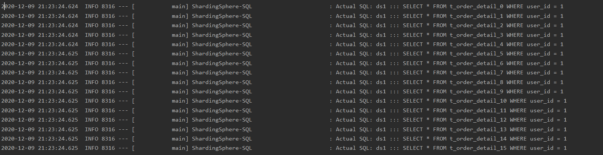
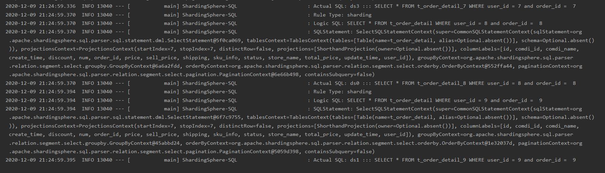
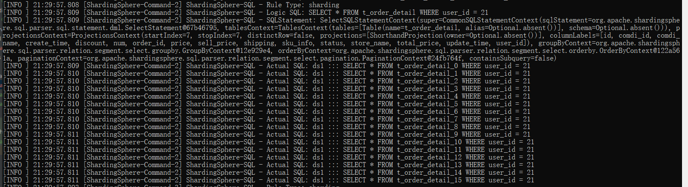
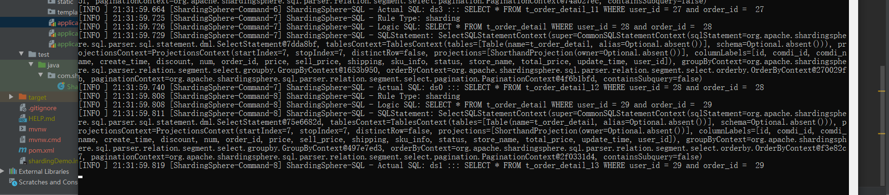

### 第八周作业

---

#### week 08 必做对订单表数据做水平拆分

- 项目 `shardingDemo` 是对订单数据库表做水平拆分demo，拆分成了4个库，，每个库16个表；分别用了`sharding-jdbc` 和 `sharding-proxy`去做拆分
- **sharding-jdbc 分库分表**: 
  - `resources/sql/` 目录下是四个分库和对应分表的初始 `sql` 脚本
  - 在`application-sharding.properties` 文件中配置了上面创建的四个库的数据源和分库分表策略，使用`userId` 分库，`orderId` 分表
  - 修改`application.properties` ，配置 `spring.profiles.active=sharding`
  - `test`目录下的`ShardingDemoApplicationTests` 测试类，是分库分表后的增删改查测试，使用简单指定的`userId 和 orderId `进行查询之类的操作时，会根据路由策略选择不同的库表进行操作，如下 :
    - 
    - 
  - 分别测试指定`userId` 和 指定`userId 以及 orderId` 进行查询的情况；可以看到，在只根据 `userId` 搜索的情况下，会因为无法路由到具体的表上，而查询该库下所有的表；而指定`userId 和 orderId` 的查询，会落到具体的库表上。
- **sharding-proxy 分库分表**:
  -  `resource` 目录下的 `sharding-proxy-config`目录下是使用 `sharding-proxy ` 配置分库分表的配置文件，指定的分库分表策略和上面使用`sharding-jdbc`指定的策略一致
  - `application-shardingproxy.properties`文件是`shardin-proxy`的数据源配置，指定了`sharding-proxy server` 使用的数据库信息
  - 通过 `sharding-proxy`实现的分库分表效果和`sharding-jdbc`一致:
    - 
    - 
  - 不存在分表键就会进行全库搜索
  - **使用 sharding-proxy 做分库分表比较简单，只需要更换项目的数据源，而且增加分库分表的配置，也不需要改动项目本身**

---

#### week 08 必做-- hmily TCC 实现分布式事务demo

- `hmilyDemo` 是个 spring-cloud 多模块项目，包含了`注册中心，用户服务，商家服务，转账服务`四个子项目，业务场景只有一个：用户向商家转账。
- `userService ，sellerService 和transfer `的 `resource` 文件分别是用户账户，商家账户和转账记录的表结构SQL，各自的 `hmily`配置文件，数据源配置文件，三个服务的数据源不在一个端口上；
- `userService和sellerService`作为服务提供方，`transfer`是转账服务，实现了`UserFeignClient 和 SellerFeignClietn`调用这两个服务。
- **TCC 实现**:

  - **TRY** : `transfer` 提供了用户向商家转账的接口，service 层的 `TransferServiceImpl` 的`transferToSeller` 方法注解了`HmilyTCC` ，并指定了`confirm和cancel`方法:	

    - ```java
      
      @HmilyTCC(confirmMethod = "transferConfirm", cancelMethod = "transferCancel")
      @Override
      public boolean transferToSeller(UserWallet userWallet, SellerWallet sellerWallet, BigDecimal transferMoney, String key) {
      
          /**
               * TCC try 预留业务资源，在这个转账的场景中，业务资源就是用户将要转账的金额
               */
          //记录try未完成
          hadTry.put(key, false);
      
          //转账
          userWallet.setFee(userWallet.getFee().subtract(transferMoney));
          userWallet.setOutcome(userWallet.getOutcome().add(transferMoney));
          //添加冻结部分资金
          userWallet.setFrozenFee(transferMoney);
          userWallet.setUpdateTime(new Date());
          //这里做了第一次update ，会导致用户账户confirm 一次
          userFeignClient.updateUserWallet(userWallet);
      
          Long recordId = System.currentTimeMillis();
          //添加转账记录
          TransferRecord transferRecord = TransferRecord.builder()
              .id(recordId)
              .userId(userWallet.getId())
              .sellerId(sellerWallet.getId())
              .status(TransferStatus.TRANSFER_ING.getCode())
              .transferFee(transferMoney)
              .createTime(new Date())
              .updateTime(new Date())
              .build();
          transferRecordJpa.save(transferRecord);
      
          //记录try已完成
          hadTry.put(key, true);
          return true;
      }
      
      ```

      

    - `HmilyTCC` 标记的方法代表`TCC`中的 `try` , 预留随后 `confirm` 中需要用到的资源，这里就是冻结部分用户账户金额 (检查用户账户等，放在了前面的biz层)

  - **CONFIRM** : `confirm`方法进行确认，这里需要做的是两步: 转账给商家，扣减用户商户的冻结金额部分。 `confirm` 可能会异常，通常是重试一定次数，如果还不能成功就放弃，需要人工介入。**这里做了处理，confirm异常的时候，判断是否已经转账给商家，是的话就手动回滚这一部分，然后再调用cancel去回滚try的操作**

    - ```java
      public boolean transferConfirm(UserWallet userWallet, SellerWallet sellerWallet, BigDecimal transferMoney, String key) {
      
          log.info("=====================================transferConfirm=======================");
          if (hadTry.containsKey(key) && hadTry.get(key)) {
              //转账
              boolean sellerUpdate = false;
              sellerWallet.setFee(sellerWallet.getFee().add(transferMoney));
              sellerWallet.setIncome(sellerWallet.getIncome().add(transferMoney));
              sellerWallet.setUpdateTime(new Date());
      
              try {
                  // 对confirm 的两次操作进行try,并标记其中的操作，任意一次失败都手动反向操作然后调用cancel
                  sellerFeignClient.updateSeller(sellerWallet);
                  sellerUpdate = true;
                  log.info("商户转账完成！");
                  //再次更新用户冻结账户信息
                  userWallet.setFrozenFee(new BigDecimal(0));
                  userWallet.setUpdateTime(new Date());
                  userFeignClient.updateUserWallet(userWallet);
              } catch (Exception e) {
                  log.error("转账confirm异常：{}", e);
                  if (sellerUpdate) {
                      log.info("商户转账失败，手动回滚!");
                      sellerWallet.setFee(sellerWallet.getFee().subtract(transferMoney));
                      sellerWallet.setIncome(sellerWallet.getIncome().subtract(transferMoney));
                      sellerWallet.setUpdateTime(new Date());
                      //但是这里可能会异常
                      sellerFeignClient.updateSeller(sellerWallet);
                  }
                  //手动cancel
                  transferCancel(userWallet, sellerWallet, transferMoney, key);
              }
      
              log.info("用户转账完成，更新用户账户信息！");
              //清除try记录
              hadTry.remove(key);
              return true;
          } else {
              log.info("try 执行异常进行了 confirm,取消此次 confirm! ");
              return false;
          }
      }
      ```

      

  - **CANCEL** : `cancel`的目标很明确，反向`try`已实现的操作，在这里就是将用户的冻结金额加回去:

    - ```java
      
      public boolean transferCancel(UserWallet userWallet, SellerWallet sellerWallet, BigDecimal transferMoney, String key) {
      
          log.info("====================================transferCancel=======================");
          //防悬挂？
          if (!hadTry.containsKey(key)) {
              log.info("try 未执行！");
              return false;
          }
          if (hadTry.containsKey(key) && !hadTry.get(key)) {
      
              userWallet.setFee(userWallet.getFee().add(transferMoney));
              userWallet.setOutcome(userWallet.getOutcome().subtract(transferMoney));
              userWallet.setUpdateTime(new Date());
              //扣减冻结金额而不是将冻结金额清零
              userWallet.setFrozenFee(userWallet.getFrozenFee().subtract(transferMoney));
              userFeignClient.updateUserWallet(userWallet);
              //清除try记录
              hadTry.remove(key);
              log.info("cancel 后用户账户信息:{}", userWallet.toString());
              return true;
          } else {
              log.info("try 未执行或已执行成功但进行了 cancel,取消此次 cancel! ");
              return false;
          }
      }
      
      ```

  - **测试**：

    - 提供了四个接口，一个用于查询用户和商家的信息，转账需要用户ID和商户ID；另外三个是正常的转账接口，模拟try阶段异常，模拟confirm阶段异常接口

---

#### 小结:

- 刚开始配置好分库分表一直提示没有库表的路由，后来才想起来分库分表的库表要自己准备
- `Hmily TCC Demo` 用`SpringCloud`写的的服务模块，以前从来没用这些，算是学了点东西

